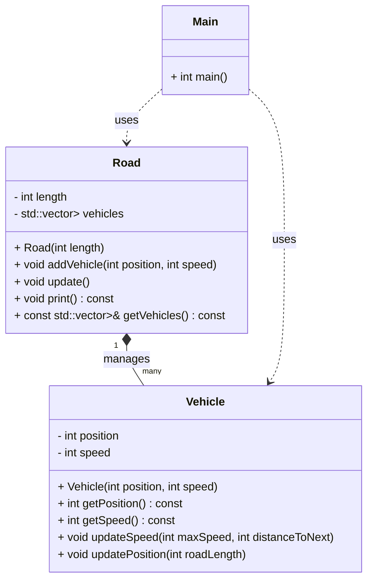

# Project Architecture

## Architecture Notes
- The `Main` program creates a `Road` and adds `Vehicle` instances.
- `Road` manages the collection of `Vehicle` objects and updates their states.
- `Vehicle` encapsulates its own state and update logic.
- The architecture is modular and suitable for AI-driven code analysis and extension.
